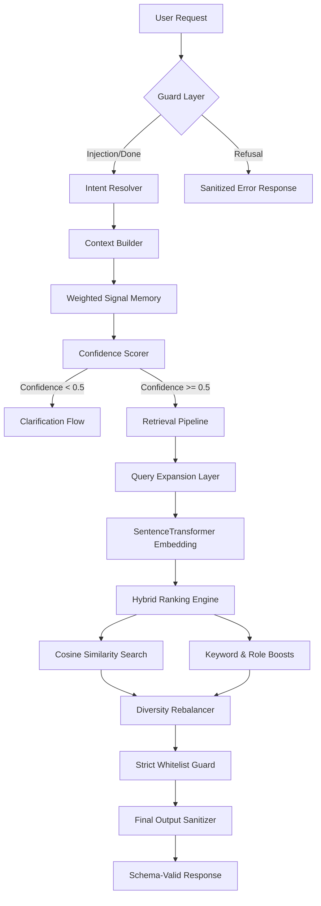
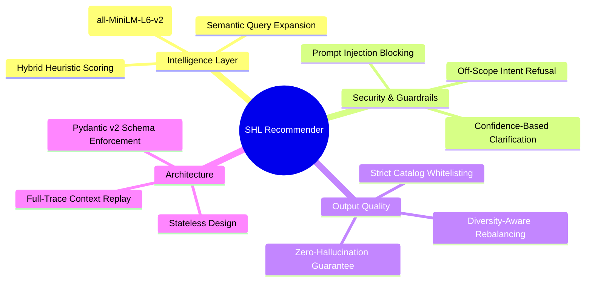

<p align="center">
  
</p>

<h1 align="center">🎯 SHL Assessment Battery Designer API</h1>

<p align="center">
  <strong>Production-grade conversational recommender for SHL Individual Test Solutions</strong>
</p>

<p align="center">
  
  
  
  
</p>

<p align="center">
  
  
  
  
</p>

---

## 🏗️ System Architecture Mind Map



---

## 🧠 System Design Philosophy



---

## ✨ Core Features

<table>
<tr>
<td width="50%">

### 🧠 Semantic-Hybrid Retrieval
- **Vector Search** — Latent similarity matching using SentenceTransformers.
- **Hybrid Scoring Engine** — Weighted boosts for keywords and role-skill alignment.
- **Domain Expansion** — Automatic technical term augmentation (e.g., Java -> Spring/OOP).
- **Battery Rebalancer** — Strict caps on test types (K, A, P, S, B) for holistic शॉर्टलिस्टs.

</td>
<td width="50%">

### 🛡️ Hardened Guardrails
- **Injection Defense** — semantic-aware detection of "ignore instructions" attacks.
- **Confidence Gating** — Weighted signal detection (Role, Skill, Seniority) to prevent vague query failures.
- **Refinement Memory** — Anchors seniority and role constraints across multiple turns to prevent ranking drift.
- **Grounded Comparison** — Fact-based markdown table generation for assessment diffs.

</td>
</tr>
</table>

---

## 🏛️ Pipeline Execution Flow

The API follows a purely functional, stateless design. Every request carries the full conversational context, allowing the engine to remain side-effect free and highly scalable.

1.  **Ingestion**: Loads 377 SHL Individual Test Solutions.
2.  **Detection**: Extracts signals and calculates confidence.
3.  **Expansion**: Augments query for high-recall matching.
4.  **Retrieval**: Semantic vector search + Hybrid keyword scoring.
5.  **Refinement**: Enforces diversity caps and whitelisting.
6.  **Sanitization**: Validates response structure before transmission.

---

## 📡 API Documentation

### POST `/chat`
Replays a full conversation history and returns a schema-valid assessment shortlist.

```bash
curl -X POST http://localhost:8000/chat \
  -H "Content-Type: application/json" \
  -d '{
    "messages": [
      {"role": "user", "content": "I need assessments for a Senior Java developer"}
    ]
  }'
```

**Response:**
```json
{
  "reply": "Based on your request, here is a diverse shortlist of SHL assessments...",
  "recommendations": [
    {
      "name": "Java (New)",
      "url": "https://www.shl.com/...",
      "test_type": "K"
    }
  ],
  "end_of_conversation": false
}
```

---

## 🚀 Quick Start

```bash
# Clone the repository
git clone <repo-url>
cd Assessment_Battery_Designer_API

# Install dependencies
pip install -r requirements.txt

# Start the API
python main.py
```

---

## 👨‍💻 Developed by

<div align="center">
  <a href="https://www.linkedin.com/in/sudheerkonduboina/">
    
  </a>
  <br/>
  <h3>Sudheer Konduboina</h3>
  <p>Software Engineer (Backend) & AIML Engineer</p>
  <a href="https://www.linkedin.com/in/sudheerkonduboina/">
    
  </a>
</div>

---

## © Copyright Notice

**© 2024 SHL Group. Assessment Battery Designer API Project.**
